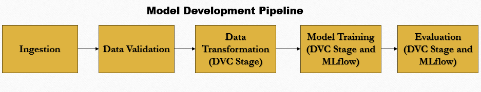
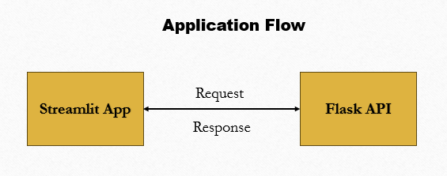
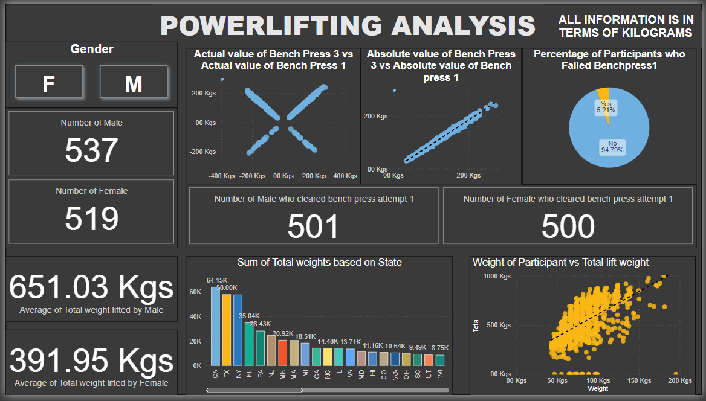
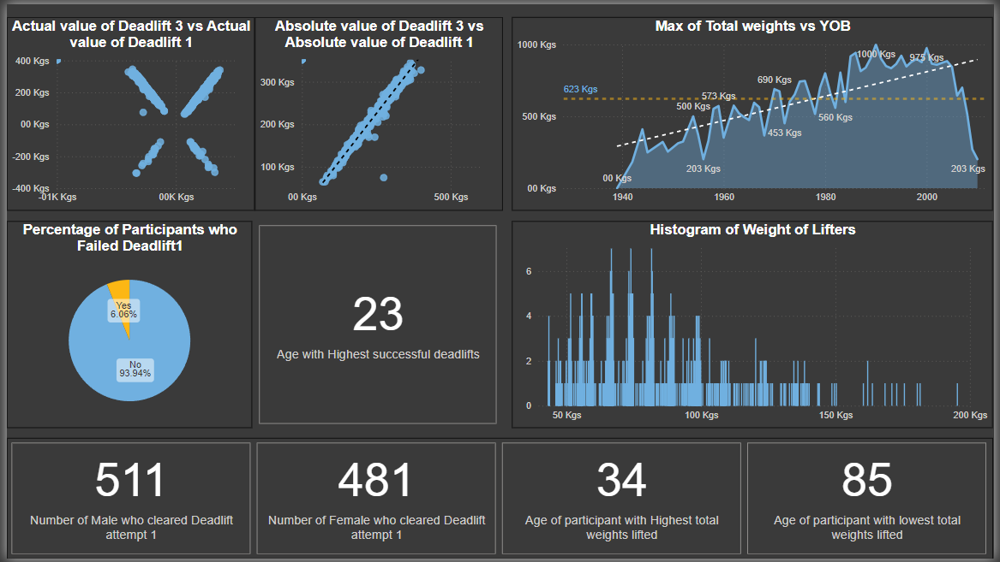
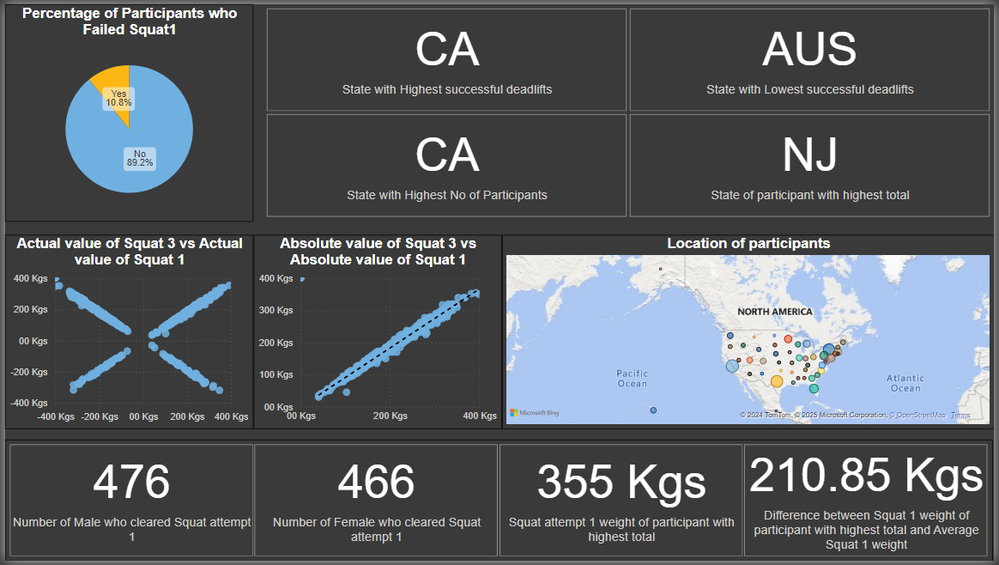

# Competitive Powerlifting Predictor  

## Overview  
Due to my background as a powerlifter, I designed this project with my domain knowledge.
It is able to accurately predict results such as weights for 2nd lift and 3rd lift along with experimentation for predicting if a lift would be successfully. 

Curated a dataset by web scraping using Selenium. 

The data had columns such as 'Name', 'Gender', 'YOB', 'State', 'Lot', 'Weight', 'Squat1', 'Squat2', 'Squat3', 'Benchpress1', 'Benchpress2', 'Benchpress3', 'Deadlift1', 'Deadlift2', 'Deadlift3','Total' and 'Points'. Additionally more features such as Age, status of various lifts were created during the feature engineering process. 

## Architecture
 

 

## Tech Stack
&emsp;→ **Versioning**: DVC, Git and GitHub  
&emsp;→ **Experiment Tracking**: MLflow  
&emsp;→ **Deployment**: Docker  
&emsp;→ **Framework**: Streamlit and Flask 

## Deployment Ready
Dockerfiles **(Dockerfile.server and Dockerfile.streamlit)** have been created for the api and the Streamlit app. 
Both the services can be set up and used using the docker compose file **(docker-compose.yml)**. 

## Results
| Model | R2 Score | 
|----------|----------|
| Bench2   | 0.995   |
| Bench3   | 0.886   |
| Deadlift2   | 0.992  |
| Deadlift3   | 0.992  |
| Squat2   | 0.993   |
| Squat3   | 0.823   |

## EDA (Using Power BI)
 
 

### FEW INSIGHTS FROM ANALYSIS

&emsp;→Maximum of Total weight lifted by Male participants are higher than Female participants  
&emsp;→Average of Total weight lifted by Male participants is 651.03 whereas Average of Total weight lifted by Female participants is 391.95  
&emsp;→Number of Male participants is 537 and Number of Female participants is 519  
&emsp;→Percentage of Participants who failed the first attempt of Benchpress is 5.21% whereas the Percentage of participants who didnt is 94.79%  
&emsp;→Number of Male participants who succeeded in the first attempt of Benchpress is 500 and Number of Female participants who 
succeeded in the first attempt of Benchpress is 501  
&emsp;→The absolute value of Benchpress1 and absolute value of Benchpress3 tend to have a linear distribution with each other, signifying &the high positive correlation between the 1st and 3rd benchpress attempt  
&emsp;→Lifters in their late 20s and early 30s tend to lift the highest  
&emsp;→Male Lifters from California had the highest total weights lifted of 41.61k and Female Lifters from Texas had the highest total weights lifted of 22.80k  
&emsp;→In generally, the participants from California had the highest total weights lifted of 64.15k  
&emsp;→There seems to be a noticeable increase in the total weights lifted as the weight of the participant increases  
&emsp;→The Maximum of total weights lifted tends to increase as the age of the participant decreases but only to a certain limit  
&emsp;→The age of participants with highest successful deadlifts is 23  
&emsp;→The absolute value of Deadlift1 and absolute value of Deadlift3 tend to have a linear distribution with each other, signifying the high positive correlation between the 1st and 3rd Deadlift attempt  
&emsp;→The age of participant with highest total weights lifted is 34 whereas The age of participant with lowest total weights lifted is 85  
&emsp;→Percentage of Participants who failed the first attempt of Deadlift is 6.06% whereas the Percentage of participants who didnt is 93.94%  
&emsp;→Number of Male participants who succeeded in the first attempt of Deadlift is 511 and Number of Female participants who succeeded in the first attempt of Deadlift is 481  
&emsp;→Percentage of Participants who failed the first attempt of Squat is 10.8% whereas the Percentage of participants who didnt is 89.2%  
&emsp;→Number of Male participants who succeeded in the first attempt of Squat is 476 and Number of Female participants who succeeded in the first attempt of Squat is 466  
&emsp;→State with the highest number of successful deadlifts is California  
&emsp;→State with the highest number of participants is California  
&emsp;→State of the participant who has the highest total weights lifted is New Jersey  
&emsp;→The Average Weight of Male lifters and the Average Weight of Female lifters had a difference of 19.77  
&emsp;→The Weight of the lifters was log normally distributed  
&emsp;→The distribution between Deadlift3 and Deadlift1 had X-shaped distribution. Similarly for Benchpress and Squat.  
&emsp;→The X-shaped distribution was due to the fact that there existed negative values for the lifts signifying the  failed lifts. 
&emsp;→The absolute value of Squat1 and absolute value of Squat3 tend to have a linear distribution with each other, signifying the high positive correlation between the 1st and 3rd Deadlift attempt  
&emsp;→The weight lifted by the participant with the highest total weights lifted is 355 Kgs for Squat attempt 1  
&emsp;→The difference between the Average weight of Squat attempt 1 and weight lifted by participant with the highest total weights for Squat attempt 1 is 210.85  